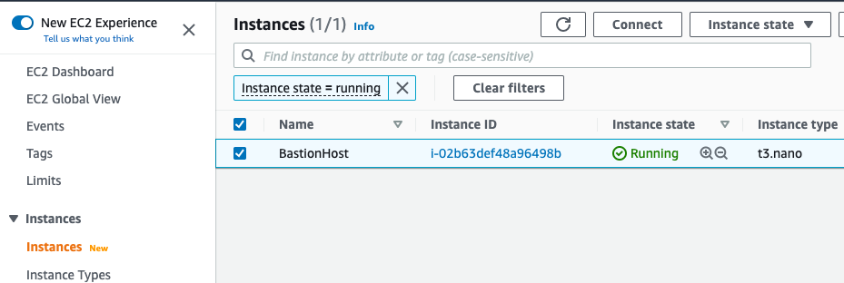
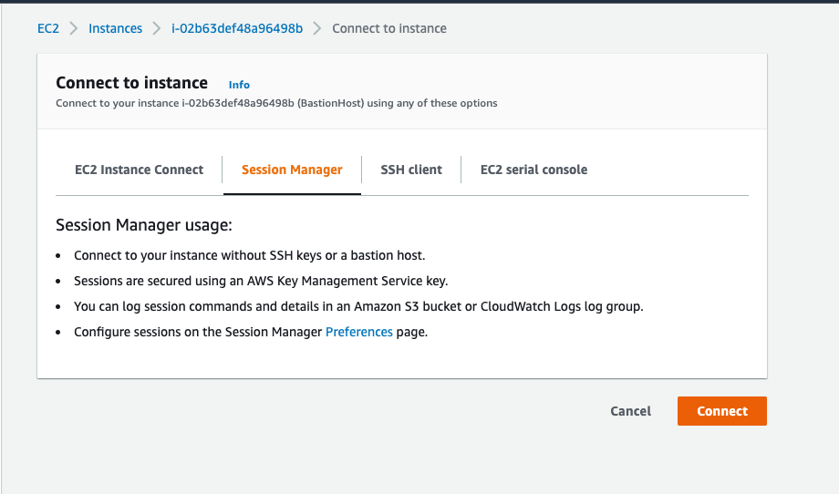

# How to Create Aurora Postgres Clusters from Snapshot with CDK

In this "How To" I walk through an example of using AWS Cloud Development Kit (CDK) to provision a network Virtual Private Cloud (VPC) with a bastion host for limited and secure access to sensitive resources like databases. Then within this VPC I create a Aurora Postgres cluster with admin credentials tied to a AWS Secrets Manager managed secret. Then I add some sample data to the cluster, create a snapshot of it, and finally use CDK to provision a new Aurora Postgres cluster from the snapshot.

### Project Setup

To start I create a new directory to work in then initialize a CDK project application within it.

```
mkdir cdk-db-clusters
cd cdk-db-clusters
cdk init sample-app --language typescript
```

Within the lib directory of the boilerplate project I remove the initially created cdk-db-clusters-stack.ts file and replace it with three new empty files named network-stack.ts, original-cluster-stack.ts, and snapshot-cluster-stack.ts as shown below. I've also removed the npm based package-lock.json file since I'll be using yarn for this example. Here is the updated directory structure omitting the node_modules directory.

```
├── README.md
├── bin
│   └── cdk-db-clusters.ts
├── cdk.json
├── jest.config.js
├── lib
│   ├── network-stack.ts
│   ├── original-cluster-stack.ts
│   └── snapshot-cluster-stack.ts
├── package.json
├── test
│   └── cdk-db-clusters.test.ts
└── tsconfig.json
```

I also like to update the package.json scripts section to include "synth", "deploy" and "destroy" entries to make the development process a little more streamlined.

```
{
  "name": "cdk-db-clusters",
  "version": "0.1.0",
  "bin": {
    "cdk-db-clusters": "bin/cdk-db-clusters.js"
  },
  "scripts": {
    "build": "tsc",
    "watch": "tsc -w",
    "test": "jest",
    "cdk": "cdk",
    "synth": "cdk synth",
    "deploy": "cdk deploy --all --require-approval=never",
    "destroy": "cdk destroy"
  },
  "devDependencies": {
    "aws-cdk": "2.43.0",
    "@types/jest": "^26.0.10",
    "@types/node": "10.17.27",
    "@types/prettier": "2.6.0",
    "jest": "^26.4.2",
    "ts-jest": "^26.2.0",
    "ts-node": "^9.0.0",
    "typescript": "~3.9.7"
  },
  "dependencies": {
    "aws-cdk-lib": "2.43.0",
    "constructs": "^10.0.0"
  }
}
```

Last setup step is to install the dependencies again to regnerate a new yarn.lock file.

```
yarn
```

### Coding and Deploying the Network Stack

Inside the network-stack.ts I add the following to define a VPC spanning 2 availability zones with each containing a public and private subnet. I also use the highlevel BastionHostLinux construct to provision a bastion host within the VPC accessible via the AWS SSM Systems Manager agent. 

```
import * as cdk from "aws-cdk-lib";
import * as ec2 from "aws-cdk-lib/aws-ec2";
import * as iam from "aws-cdk-lib/aws-iam";

import { Construct } from "constructs";


export class MyNetworkStack extends cdk.Stack {
  readonly vpc: ec2.Vpc;

  constructor(scope: Construct, id: string, props?: cdk.StackProps) {
    super(scope, id, props);

    this.vpc = new ec2.Vpc(this, "vpc", { maxAzs: 2 });
    const bastion = new ec2.BastionHostLinux(this, "bastion", { vpc: this.vpc });
    bastion.role.addToPrincipalPolicy(new iam.PolicyStatement({
      actions: ["secretsmanager:GetSecretValue", "rds:*"],
      effect: iam.Effect.ALLOW,
      resources: ["*"]
    }));

    new cdk.CfnOutput(this, "vpcId", {
      value: this.vpc.vpcId
    });
  }
}
```

At this point I can update the bin/cdk-db-clusters.ts to instantiate the MyNetworkStack and provision the VPC and Bastion Host.

```
#!/usr/bin/env node
import * as cdk from 'aws-cdk-lib';
import { MyNetworkStack } from '../lib/network-stack';

const app = new cdk.App();
new MyNetworkStack(app, 'MyNetworkStack');
```

Then delete the example unittest that is created as part of the sample project, run the build, synth and deploy NPM scripts like so.

```
rm test/cdk-db-clusters.test.ts
yarn build
yarn synth
yarn deploy
```

Of course, in a enterprise / business project you'd want to write unittests to keep your Infrastructure as Code (IaC) protected but, given this is a simple demonstration I'll omit them.


### Coding and Deploying the Original Cluster Stack

Here I move on to creating the initial Aurora Postgres cluster that will be used as the basis for generating a snapshot to be used in the next section to show how to create a Aurora Postgres cluster from a snapshot. Over in the lib/original-cluster-stack.ts I use the following IaC to accomplish this.

```
import * as cdk from "aws-cdk-lib";
import * as ec2 from "aws-cdk-lib/aws-ec2";
import * as rds from "aws-cdk-lib/aws-rds";

import { Construct } from "constructs";


export interface MyDatabaseClusterProps extends cdk.StackProps {
  readonly vpc: ec2.Vpc;
}


export class MyDatabaseClusterStack extends cdk.Stack {
  constructor(scope: Construct, id: string, props: MyDatabaseClusterProps) {
    super(scope, id, props);
    
    const cluster = new rds.DatabaseCluster(this, "my-db-cluster", {
      clusterIdentifier: "my-db-original",
      engine: rds.DatabaseClusterEngine.auroraPostgres({ version: rds.AuroraPostgresEngineVersion.VER_11_13 }),
      instanceProps: {
        vpc: props.vpc,
        vpcSubnets: {
          subnetType: ec2.SubnetType.PRIVATE_WITH_NAT
        }
      },
      storageEncrypted: true
    });
    cluster.addRotationSingleUser();
    cluster.connections.allowFrom(
      ec2.Peer.ipv4(props.vpc.vpcCidrBlock),
      ec2.Port.tcp(cluster.clusterEndpoint.port)
    );

    new cdk.CfnOutput(this, "cluster-host", {
      value: cluster.clusterEndpoint.hostname
    });
    new cdk.CfnOutput(this, "cluster-port", {
      value: `${cluster.clusterEndpoint.port}`
    });
    new cdk.CfnOutput(this, "cluster-secret", {
      value: cluster.secret?.secretArn!
    });
    
  }
}
```

Then update bin/cdk-db-clusters.ts to use the new MyDatabaseClusterStack like so.

```
#!/usr/bin/env node
import * as cdk from 'aws-cdk-lib';
import { MyNetworkStack } from '../lib/network-stack';
import { MyDatabaseClusterStack } from '../lib/original-cluster-stack';

const app = new cdk.App();
const networkStack = new MyNetworkStack(app, 'MyNetworkStack');
new MyDatabaseClusterStack(app, "MyDatabaseClusterStack", {
  vpc: networkStack.vpc
});
```

Build, synth, and deploy the new stack.

```
yarn build
yarn synth
yarn deploy
```

Make note of the cluster secret arn output value as that will be needed later.

### Accessing Original Cluster from Bastion Host and Loading Data into Original Cluster

From the EC2 console I navigate to the Instances view and find the bastion host, check it's row, and click connect.




On the next screen select the SSM Tab and click connect.




Once the browser based terminal is active I switch user the standard ec2-user which comes with the Amazon Linux 2 AMI that is the foundation of this bastion host. In order to connect to the database I'll need the [Postgres CLI utility psql](https://www.postgresql.org/docs/current/app-psql.html) which is available within the amazon-linux-extras package repository.

```
sudo su - ec2-user
sudo amazon-linux-extras enable postgresql11
sudo yum install postgresql -y
sudo yum install jq -y
```

Copy the Cluster Secret ARN from the last section (either from the terminal where yarn deploy was ran or from the CloudFormation stack outputs tab) and save it as a variable name within the browser based terminal connected to the bastion host. Use that to fetch the Secret using the AWS CLI.

```
SECRET_ARN="FILL-IN-ARN-HERE"
aws secretsmanager get-secret-value --secret-id $SECRET_ARN --region us-east-1 | jq -r '.SecretString' | jq .
{
  "dbClusterIdentifier": "my-db-original",
  "password": "qa85fKRQ1g8ibt27pz,t0D=,dBUIma^6",
  "engine": "postgres",
  "port": 5432,
  "host": "my-db-original.cluster-cgxu89d3kh18.us-east-1.rds.amazonaws.com",
  "username": "postgres"
}
```

For convienence I'm going to parse the secret output into some reusable environment variables reducing my liklihood of having a typo when connecting to the database.

```
export PGHOST=$(aws secretsmanager get-secret-value --secret-id $SECRET_ARN --region us-east-1 | jq -r '.SecretString' | jq -r '.host')

export PGPORT=$(aws secretsmanager get-secret-value --secret-id $SECRET_ARN --region us-east-1 | jq -r '.SecretString' | jq -r '.port')

export PGUSER=$(aws secretsmanager get-secret-value --secret-id $SECRET_ARN --region us-east-1 | jq -r '.SecretString' | jq -r '.username')

export PGPASSWORD=$(aws secretsmanager get-secret-value --secret-id $SECRET_ARN --region us-east-1 | jq -r '.SecretString' | jq -r '.password')
```

Now I can use use those variables to connect to the database where I'll create a words database and table then populate the table with some data to test with. See the following Postgres docs for more info on [connecting with psql](https://www.postgresql.org/docs/current/app-psql.html) or the available [psql environment variables](https://www.postgresql.org/docs/current/libpq-envars.html).

```
[ec2-user@ip-10-0-156-182 ~]$ psql
psql (11.16, server 11.13)
SSL connection (protocol: TLSv1.2, cipher: ECDHE-RSA-AES256-GCM-SHA384, bits: 256, compression: off)
Type "help" for help.

postgres=> create database words;
CREATE DATABASE
postgres=> \c words
psql (11.16, server 11.13)
SSL connection (protocol: TLSv1.2, cipher: ECDHE-RSA-AES256-GCM-SHA384, bits: 256, compression: off)
You are now connected to database "words" as user "postgres".
words=> 
words=> create table words (id serial primary key, word varchar(100));
CREATE TABLE
words=> 
words=> insert into words (word) values ('apple'), ('boat'), ('car'), ('bike');
INSERT 0 4
words=> 
words=> select * from words;
 id | word
----+-------
  1 | apple
  2 | boat
  3 | car
  4 | bike
(4 rows)
```

Finally I exit with \q in the psql terminal.

### Generating Snapshot from Original Cluster

From within the browser based terminal of the bastion host I'll use the AWS CLI again but this time to create a snapshot of the orignal cluster.

```
aws rds create-db-cluster-snapshot --region us-east-1 \
  --db-cluster-identifier my-db-original \
  --db-cluster-snapshot-identifier my-db-original-snapshot
```

Before moving forward I must wait for the snapshot to finialize. I can again use the AWS CLI to check the status of it. Once it reports available I can proceed.

```
aws rds describe-db-cluster-snapshots --region us-east-1 \
  --db-cluster-identifier my-db-original \
  --db-cluster-snapshot-identifier my-db-original-snapshot | jq '.DBClusterSnapshots[].Status'
```

### Coding and Deploying the Snapshot Cluster Stack

Back in my code editor I can code up the last stack, snapshot-cluster-stack.ts, which will create a new Aurora Postgres cluster from the snapshot I created in the last section.

```

```


### Cleanup and Conclusion

